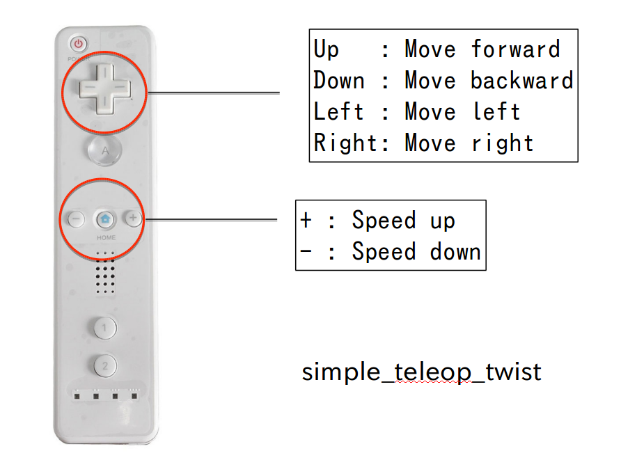

# About
Convert Joy message subscribed by wiimote to Twist message

## Docker

[wiimote-ros-docker](https://github.com/ShigemichiMatsuzaki/wiimote-ros-docker)

## How to launch
1. Connect a wiimote to your PC.

1. Run **wiimote_teleop_node**
```
 $ rosrun wiimote_teleop wiimote_teleop_node
```

## Usage



## Messages
### Subscribed
/joy ([sensor_msgs/Joy](http://docs.ros.org/en/melodic/api/sensor_msgs/html/msg/Joy.html))

Topic from a controller

### Published
/cmd_vel ([sensor_msgs/Twist](http://docs.ros.org/en/melodic/api/sensor_msgs/html/msg/Twist.html))

Control command sent to a robot
